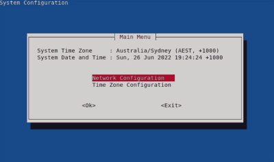

# deb-setup-gui
Debain - GUI for setting up system basics (network, hostname and timezone)

Please check the code to ensure you know what it is doing.  
Use at your own risk.

It is meant as inspiration or as a general guide on how to achieve a working GUI
with the ability to do some error checking before applying the config.

